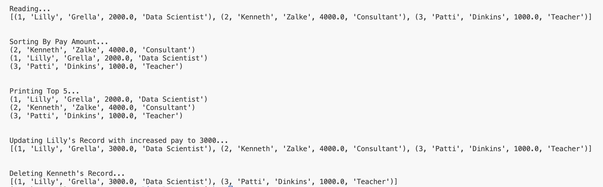

# Mini-Project 5: IDS 706 Data Engineering Systems
---
Python Script interacting with SQL Database

Goal:
Connect to SQLite database, perform ETL operations and CRUD sql operations

---
## Github Actions:

---

## Screenshots of Queries:

