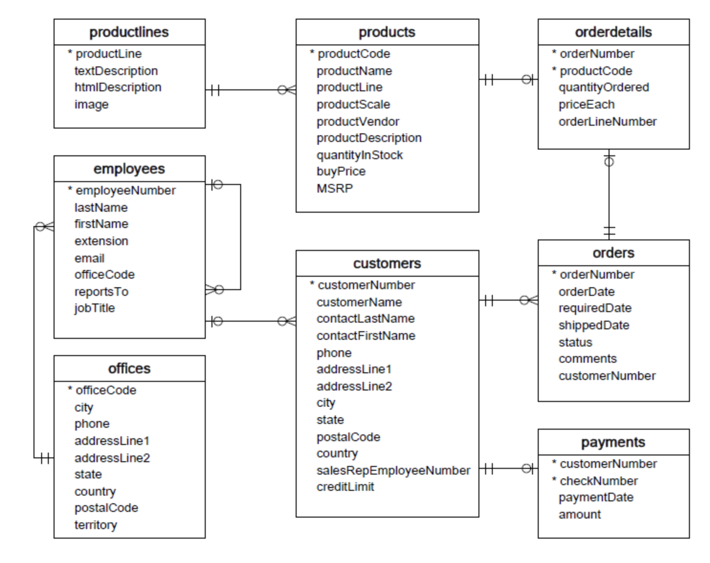
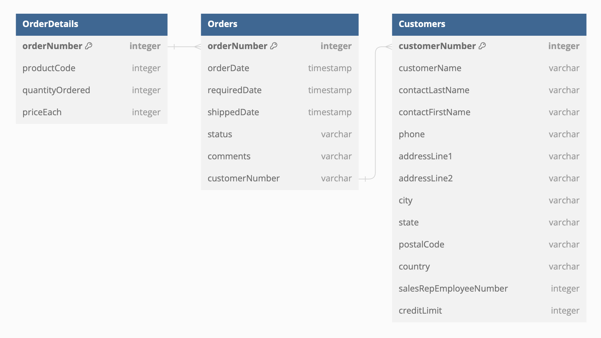
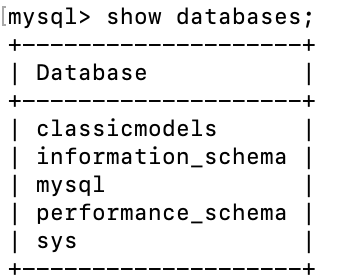
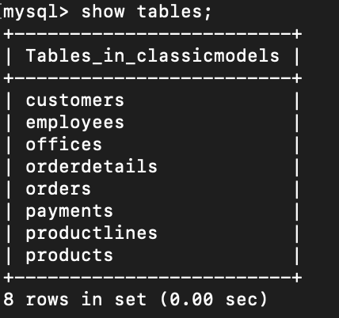
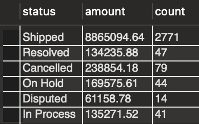
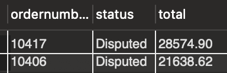

# Mini-Project 6: IDS 706 Data Engineering Systems
---
Complex SQL Query for a MySQL Database

Goal:
* Design a complex SQL query involving joins, aggregation, and sorting
* Provide an explanation for what the query is doing and the expected results
* 
---
## Github Actions:
[](https://github.com/nogibjj/sqlite-lab-LG/actions/workflows/cicd.yml)
---

---
 I chose to use a database that was set up by MySQL as an example database for this exercise. You can find mySQL's details [here](https://www.mysqltutorial.org/mysql-sample-database.aspx).

 As an overview of the entire database, the following diagram shows how each table interacts with eachother, along with each table's variables. Stars flag the keys of each table



 To further detail the specific tables I will work with in my queries, here is a more detailed diagram, which also outlines data types and specific linking.


---

## First, I create a database in mySQL which holds all the tables needed for the analysis, as shown in the following command line screenshots.




---
# Complex Queries:

```sql
USE `classicmodels`;

SELECT 
    status, 
    SUM(quantityOrdered * priceEach) AS amount, COUNT(quantityOrdered) AS count
FROM
    orders
INNER JOIN orderdetails 
    USING (orderNumber)
GROUP BY 
    status;   
    
SELECT 
    a.ordernumber, 
    status, 
    SUM(priceeach*quantityOrdered) total
FROM
    orderdetails a
INNER JOIN orders b 
    ON b.ordernumber = a.ordernumber
GROUP BY  
    ordernumber, 
    status
HAVING 
    status = 'Disputed' AND 
    total > 15000
ORDER BY
    total desc;
```


# Their Execution:
## Query 1: 


## Query 2:


# Explanation

The intention of these queries are to flag disputed orders in the order they need to be investigated by the company. I a total order value of $15,000 as the threshold of being investigated.    

## SQL Code for the first query:
```sql
SELECT 
    status, 
    SUM(quantityOrdered * priceEach) AS amount, COUNT(quantityOrdered) AS count
FROM
    orders
INNER JOIN orderdetails 
    USING (orderNumber)
GROUP BY 
    status;   
```

First, I want to get a big picture understanding of how much money the company is making, number of orders, and how they are distributed by status. 

## Select Statement:
First, for the output, I want to select status, total amount made as amount through the summation of quantity*price, and the number of orders by using the count function. This is completed by the following select statement. 
```sql
SELECT 
    status, 
    SUM(quantityOrdered * priceEach) AS amount, COUNT(quantityOrdered) AS count
```
## Join:
Next, I need to merge orderdetails with orders since status is on orders and price and quantity are on orderdetails. The following merge code performs an inner join between the two datasets, orders and orderdetails, based on the primary key that appears on each dataset, orderNumber. 
```sql
FROM
    orders
INNER JOIN orderdetails 
    USING (orderNumber)
```
## GROUP BY Statement:
Lastly, I group by status in order for our final result to only have as many rows as unique values in Status. I want to aggregate by Status, and GROUP BY accomplishes this.
```sql
GROUP BY 
    status; 
```

When running this together, the output is:


# Query 2:

The point of this query is to flag specific orders, rather than an aggregate of orders, for the company to investigate.

## SQL Code for the second query:

```sql
SELECT 
    a.ordernumber, 
    status, 
    SUM(priceeach*quantityOrdered) total
FROM
    orderdetails a
INNER JOIN orders b 
    ON b.ordernumber = a.ordernumber
GROUP BY  
    ordernumber, 
    status
HAVING 
    status = 'Disputed' AND 
    total > 15000
ORDER BY
    total desc;
```


## Select Statement:
First, for the output, I want to select status, total amount made as amount through the summation of quantity*price, and the ordernumber itself, rather than the count as I got in the first query. This is completed by the following select statement. 
```sql
SELECT 
    a.ordernumber, 
    status, 
    SUM(priceeach*quantityOrdered) total
```
## Join:
Next, In similar fashion to the first query, I merge orders and orderdetails on ordernumber. To practice SQL merges, I used the ON formatting of a merge in this merge as compared to the USING format in the previous query. 
```sql
FROM
    orderdetails a
INNER JOIN orders b 
    ON b.ordernumber = a.ordernumber
```
## GROUP BY Statement:
Next, I group by status and ordernumber. While this may seem as an extra step, I wanted to confirm ordernumbers are not reused throughout the data. 
```sql
GROUP BY  
    ordernumber, 
    status
```
## HAVING Statement:
This uses the results of the sql query up to this point and restricts the final output. I have chosen, in order to answer my research question, to restrict to "Disputed" orders and orders over $15,000.
```sql
HAVING 
    status = 'Disputed' AND 
    total > 15000
```
## ORDER BY Statement:
Lastly, I sort the final output in descending order total amount. I do this so that the company has the largest orders at the top of the list to deal with first. Order by tells sql to sort, and desc prompts it to sort in descending order.  
```sql
ORDER BY
    total desc;
```

# Ultimately, when running this second query, the final output is as follows:


